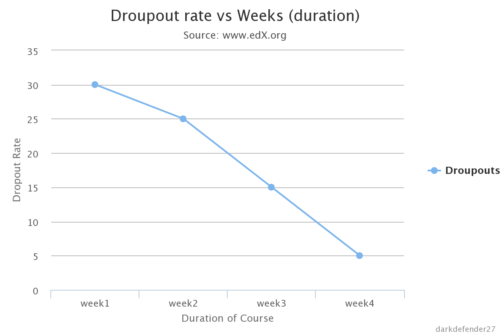
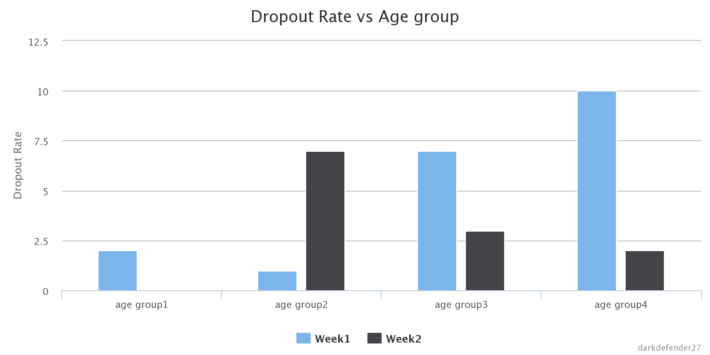
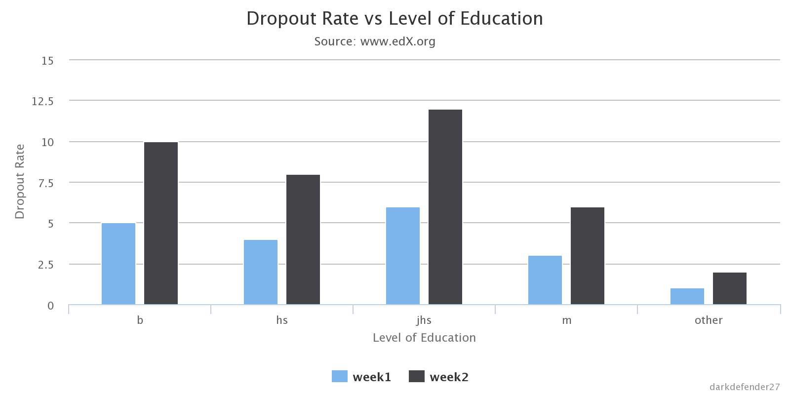
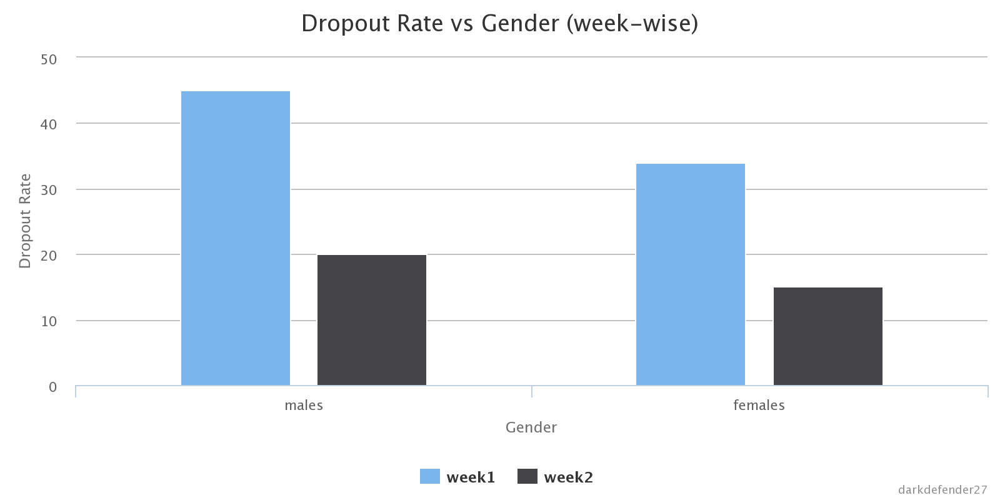
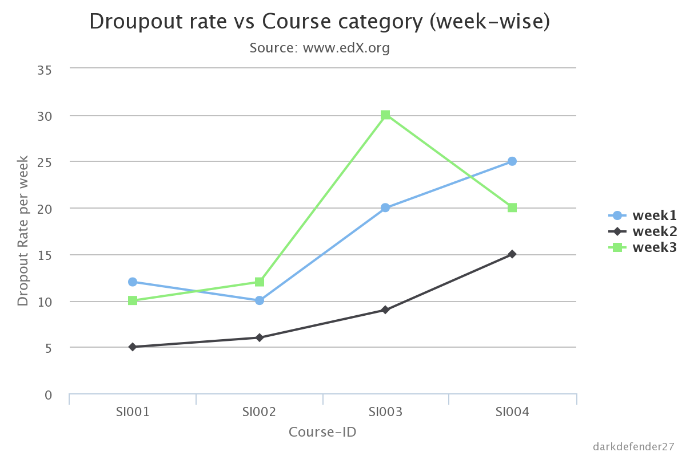
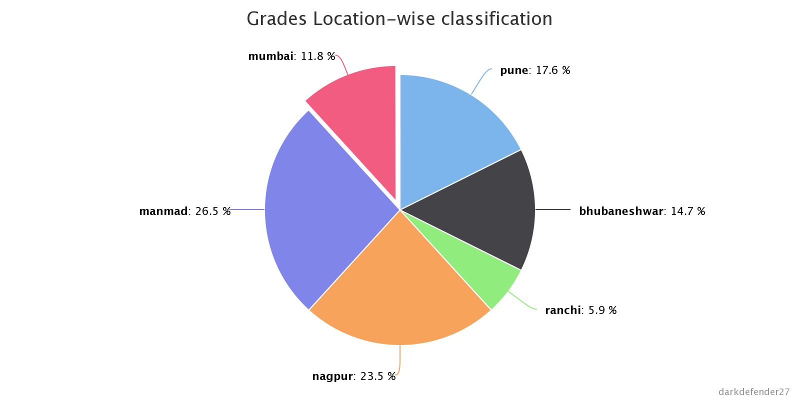
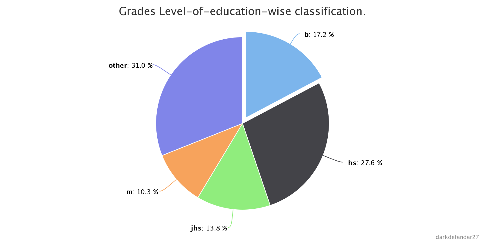
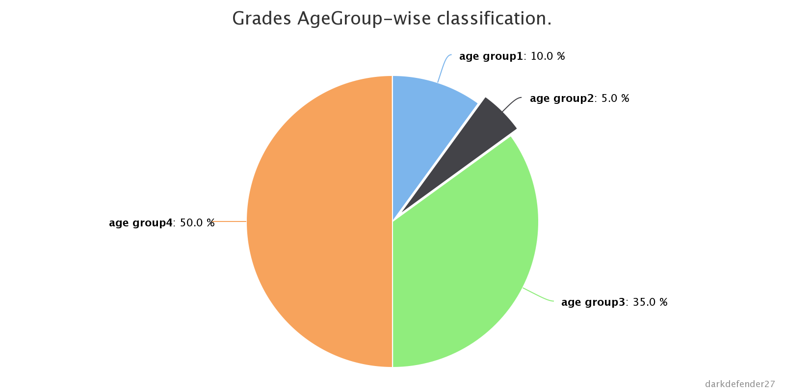

==================
DATA VISUALISATION
==================

    Data visualization or data visualisation is a modern branch of descriptive statistics. It involves the creation and study of the visual representation of data, meaning "information that has been abstracted in some schematic form, including attributes or variables for the units of information."

    There are different approaches on the scope of data visualization. One common focus is on information presentation. In this, there are presumably two main parts of data visualization: **statistical graphics**, and thematic cartography. We here deal with statistical graphics.

- We have written hive queries to extract statistical data from the hive database.
- The output of the hive queries is exported to csv file (tsv file or json or xml files can also be used).
- These files are used as input for plotting the graphs.
- We have tried the highcharts.js javascript library to plot a varied range of charts.
- Highcharts is a JavaScript library used for manipulating documents based on data.
- Highcharts helps you to bring data to life using HTML, CSS, JQuery and Javascript.

Hive Queries
************

Following are the Hive queries used for data extraction from Hive database.

-   Students who have registered for a course in their first login but have never activated their account.
    This includes the students who have registered on the site, browsed through the courses and then never activated their account through their mail.
        Query ::

            SQL> select (select count(*) from auth_user where is_active=0)/(select count(id)
                 from auth_user)*100 as pct_inactive;

        Tables used: **auth_user**

-   Dropouts (who never came back to continue the course)
    Number of drop outs in the corresponding weeks.
        Query ::

            SQL> select count(*) from auth_user au where datediff(au.last_login,au.date_joined)>=0
                 and datediff(au.last_login,au.date_joined)<7;

        Tables used: **auth_user**

        Output :

            The number of students who have droped out of the course in the corresponding weeks.

		Description:

		    The user is asked about the number of weeks for which the data is required.
		    The above query represents the data extracted for the first week.
		    The last_login and the date_joined corresponding to each of the user are compared and their difference is taken into consideration. This gives us the number of weeks for which the user has been inactive. A count of such users is taken for that particular week.
		    Similarly, the data for the further weeks is queried.

        CSV Format:

            The above code implements the defined query and stores the results in a csv file: *category1.csv*.
            The results are stored in the following format ::

                week1,week2,week3,week4
                no. OfDropouts in week 1,no OfDropouts in week 2,no OfDropouts in week 3,
                no OfDropouts in week 4

        *NOTE:*
            The csv file serves as a input to the data visualisation.

    Distrubution of drop outs according to their age group.
        Query ::

            SQL> select count(*) from auth_user au,auth_userprofile aup where
                 datediff(au.last_login,au.date_joined)<7 and au.id=aup.user_id and
                 aup.year_of_birth>=1975 and aup.year_of_birth<1980;

        Tables used: **auth_user, auth_userprofile**

        Output :

            The year_of_birth of the students who have dropped out in the corresponding week.

		Description:

		    The user provides with the yearGap for the range of the years for which the students are to classified and also the number of weeks for which the result is desired.
		    The difference between the last_login and the date_joined gives the number of days for which a user has been inactive.
		    The year_of_birth of the students are then taken as output to classify them into the various age groups accordingly.

        CSV Format:

            The java code implements the defined query and stores the results in a csv file: *category2.csv*.
            The results are stored in the following format ::

                ageGroup1,ageGroup2,ageGroup3,ageGroup4
                week1,no. OfDropouts in week 1 separated by “,”
                week2,no. OfDropouts in week 2 separated by “,”
                week3,no. OfDropouts in week 3 separated by “,”
                week4n,o. OfDropouts in week 4 separated by “,”

        *NOTE:*
            The csv file serves as a input to the data visualisation.

    Distrubution of drop outs according to their education.

        Query ::

            SQL> select count(*), level_of_education from (select * from auth_userprofile aup where aup.user_id in (select au.id from auth_user au where datediff(au.last_login,au.date_joined)<7))y group by y.level_of_education

        Tables used: **auth_user, auth_userprofile**

        Output :

            The number of drop-outs corresponding to each level_of_education and each week

		Description:

		    The user provides the number of weeks for which the data is required.
		    First, the total number of drop-outs corresponding to a particular week are taken.
		    Their id from auth_user and auth_userprofile are compared and then they are grouped by education so that all categories of education are obtained.
		    A count for each group of education is made and output.

        CSV Format:

            The above code implements the defined query and stores the results in a csv file: *category3.csv* .
            The results are stored in the following format ::

                levelOfEducation1,levelOfEducation2,levelOfEducation3,levelOfEducation4
                week1,no. OfDropouts in week 1 separated by “,”
                week2,no. OfDropouts in week 2 separated by “,”
                week3,no. OfDropouts in week 3 separated by “,”
                week4n,o. OfDropouts in week 4 separated by “,”

        *NOTE:*
            The csv file serves as a input to the data visualisation.

    Distrubution of drop outs according to their education.

        Query ::

            SQL> select count(*),aup.gender from auth_user au join auth_userprofile aup on where
            au.id=aup.user_id datediff(au.last_login,au.date_joined)<7 group by aup.gender;

        Tables used: **auth_user, auth_userprofile**

        Output :

            The total number of males/females drop-outs corresponding to each week.

		Description:

		    The user provides the number of weeks for which the data is required.
		    The two tables are joined using the user_id of each user.
		    The count is made for each category of gender and is output along with the category.

        CSV Format:

            The above code implements the defined query and stores the results in a csv file: *category4.csv*.
            The results are stored in the following format ::

                Males,Females
                week1,no. OfDropouts in week 1 separated by “,”
                week2,no. OfDropouts in week 2 separated by “,”
                week3,no. OfDropouts in week 3 separated by “,”
                week4n,o. OfDropouts in week 4 separated by “,”

        *NOTE:*
            The csv file serves as a input to the data visualisation.

    Distrubution of drop outs according to course category.

        Query ::

            SQL> select count(*) from auth_user au,auth_userprofile aup,courseware_studentmodule csm
             where datediff(au.last_login,au.date_joined)<7 and au.id=aup.user_id and csm.student_id=au.id
             and csm.course_id='Summer_Intern_IIT_Mumbai/SI001/2014_SI_May';

        Tables used: **auth_user, auth_userprofile, courseware_studentmodule**

        Output :

            The query returns the number of drop-out students belonging to that particular course in a particular week. Data for a series of weeks is returned through the java program.

		Description:

		    Course_category and the number of weeks for which the data is required are input to the java program.
		    The three tables are joined using the unique user_ids.
		    A count of such users is made who have left in a particular week in that particular subject.

        CSV Format:

            The above code implements the defined query and stores the results in a csv file: *category5.csv*.
            The results are stored in the following format ::

                SI001, SI002, SI003, SI004
                week1,no. OfDropouts in week 1 separated by “,”
                week2,no. OfDropouts in week 2 separated by “,”
                week3,no. OfDropouts in week 3 separated by “,”
                week4n,o. OfDropouts in week 4 separated by “,”

        *NOTE:*
            The csv file serves as a input to the data visualisation.

-   Grades of students depending on the various factors (for a particular subject):

    Distrubution of grades according to location.

        Query ::

            SQL> select sum(grade)/count(*),level_of_education from courseware_studentmodule
            join auth_userprofile on student_id=user_id and course_id='Summer_Intern_IIT_Mumbai/SI001/2014_SI_May'
            group by auth_userprofile.location;

        Tables used: **courseware_studentmodule, auth_userprofile**

        Output :

            The query returns the avarege grade corresponding to each location for every location that has been registered.

		Description:

		    The user provides with the course_id for which the result is required.
		    The two tables are joined on the unique user_id for each user(student) and the given subject is compared in the courseware_student module table.
		    The query is grouped by location and then the average grade corresponding to that particular location is obtained.
		    The "sum(grade)/count(*)" gives the average grade for each particular location.

        CSV Format:
            The above code implements the defined query and stores the results in a csv file: *category7.csv*.
            The results are stored in the following format ::

                Line 1 : Different locations seperated by “,”
                Line 2 : Average grades of corresponding locations separated by “,”

        *NOTE:*
            The csv file serves as a input to the data visualisation.

    Distrubution of grades according to their education level.

        Query ::

            SQL> select sum(grade)/count(*),level_of_education from courseware_studentmodule
            join auth_userprofile on student_id=user_id and course_id='Summer_Intern_IIT_Mumbai/SI001/2014_SI_May'
            group by level_of_education;

        Tables used: **courseware_studentmodule, auth_userprofile**

        Output :

            The query returns the avarege grade corresponding to each education level for every education level that has been registered.

		Description:

		    The user provides with the course_id for which the result is required.
		    The two tables are joined on the unique user_id for each user(student) and the given subject is compared in the courseware_student module table.
		    The query is grouped by education level and then the average grade corresponding to that particular education level is obtained.
		    The "sum(grade)/count(*)" gives the average grade for each particular education level.

        CSV Format:

            The above code implements the defined query and stores the results in a csv file: *category8.csv*.
            The results are stored in the following format ::

                Line 1 : Different levels of education separated by “,”
                Line 2 : Average grades of corresponding education level separated by “,”

        *NOTE:*
            The csv file serves as a input to the data visualisation.

    Distrubution of grades according to gender.

        Query ::

            SQL> select sum(grade)/count(*),gender from courseware_studentmodule join
            auth_userprofile on student_id=user_id and gender='m' and course_id =
            'Summer_Intern_IIT_Mumbai/SI001/2014_SI_May' group by gender;

        Tables used: **courseware_studentmodule, auth_userprofile**

        Output :

            The query returns the avarege grade corresponding to each gender for every gender that has been registered.

		Description:

		    The user provides with the course_id for which the result is required.
		    The two tables are joined on the unique user_id for each user(student) and the given subject is compared in the courseware_student module table.
		    The query is grouped by gender and then the average grade corresponding to that particular gender is obtained.
		    The "sum(grade)/count(*)" gives the average grade for each particular gender.

        CSV Format:

            The above code implements the defined query and stores the results in a csv file: *category9.csv*.
            The results are stored in the following format ::

                Line 1 : Different genders separated by “,”
                Line 2 : Average grades of corresponding gender separated by “,”

        *NOTE:*
            The csv file serves as a input to the data visualisation.

Java Code
*********

We have written Java code for merging the output from the above hive queries in formatted csv (comma separated values)
file. Following is a snippet for the same.

Code snipet of java program calculating distribution of drop-outs according to age group and storing it in a csv file ::

    import java.sql.*;
    import java.util.ArrayList;
    import java.util.Scanner;
    import java.io.BufferedWriter;
    import java.io.File;
    import java.io.FileWriter;
    import java.io.IOException;

    public class category2
    {
        private Connection connect = null;
        private Statement statement = null;
        private PreparedStatement preparedStatement = null;
        private ResultSet resultSet = null;
        Scanner in = new Scanner(System.in);
        private int yearGap;
        private int numberOfWeeks;
        ArrayList<Integer> yearOfBirth = new ArrayList<Integer>();
        private int arraySize;
        private int minBirthYear;
        private int maxBirthYear;
        private int[][] ageGroup;
        private int flag;
        private int i;
        private int j;
        private int k;
        private double tmp;
        private int start;
        private int end;

        public static void main(String args[])
        {
            category2 fa = new category2();
            fa.attempts();
        }
        public void attempts()
        {
            try
            {
                connect = Connect.GetConnection();
                statement = connect.createStatement();

                statement.executeQuery("use edxapp1");
                /*resultSet = statement.executeQuery("select distinct student_id from
                courseware_studentmodule");
                System.out.println("after query execution");
                while(resultSet.next())
                {
                    System.out.println(resultSet.getString(1));
                    System.out.println("Inside while");
                }*/

                /*
                 *
                 *
                 * Drop-outs according to age group(birth year)
                 *
                 * */
                /*
                 * get the number of weeks
                 * set the start and end of each week:start,end
                 * run query for each week
                 * store result of each week accordingly
                 *
                 * */
                System.out.println("Enter the age group range:");
                yearGap = in.nextInt();
                System.out.println("Enter the number of weeks for which the data is required:");
                numberOfWeeks = in.nextInt();
                i=numberOfWeeks;
                resultSet = statement.executeQuery("select aup.year_of_birth from auth_user au
                join auth_userprofile aup on au.id=aup.user_id where aup.year_of_birth!=0");
                resultSet.next();
                minBirthYear=resultSet.getInt(1);
                maxBirthYear=resultSet.getInt(1);
                do{
                    if(minBirthYear>resultSet.getInt(1))
                    {
                        minBirthYear=resultSet.getInt(1);
                    }
                    if(maxBirthYear<resultSet.getInt(1))
                    {
                        maxBirthYear=resultSet.getInt(1);
                    }
                }while(resultSet.next());

                System.out.println(minBirthYear);
                System.out.println(maxBirthYear);
                tmp = (maxBirthYear-minBirthYear)/yearGap;
                System.out.println("tmp :"+tmp);
                tmp = Math.ceil(tmp);
                System.out.println("tmp :"+tmp);
                tmp++;
                ageGroup = new int[numberOfWeeks+1][(int) tmp];
                //System.out.println("age group length is:"+ageGroup.length);

                start=0;
                end=7;
                i=0;
                while(i<numberOfWeeks)
                {
                    System.out.println("inside number of weeks");
                    resultSet = statement.executeQuery("select aup.year_of_birth from
                    auth_user au join auth_userprofile aup on au.id=aup.user_id where datediff
                    (au.last_login,au.date_joined)>="+start+" and datediff(au.last_login,au.date_joined)
                    <"+end+" and aup.year_of_birth!=0");

                    while(resultSet.next())
                    {
                        //System.out.println("**********");
                        yearOfBirth.add(resultSet.getInt(1));
                        System.out.println(resultSet.getInt(1));
                    }

                    flag=minBirthYear;
                    arraySize = yearOfBirth.size();
                    System.out.println(arraySize);

                    j=0;
                    //iterate over each age group
                    while(flag<maxBirthYear)
                    {
                        k=0;
                        //iterate over all the year_of_births retrieved
                        while(k<arraySize)
                        {
                            if((int)yearOfBirth.get(k)>=flag && (int)yearOfBirth.get(k)<flag+yearGap)
                            {
                                ageGroup[i][j]++;
                            }
                            k++;
                        }
                        System.out.print(ageGroup[i][j]+"\t");
                        j++;
                        flag+=yearGap;
                    }

                    yearOfBirth.clear();
                    System.out.println();

                    i++;
                    start+=7;
                    end+=7;
                }
                //System.out.println("here 1");

                //put the years in the appropriate categories

                //write to file

            }
            catch(Exception ex)
            {
                System.out.println(ex);
            }
            finally
            {
                try
                {
                    connect.close();
                }
                catch (SQLException e)
                {
                    e.printStackTrace();
                }
            }
            try {
                String content = "";
                String content1 = "";
                //System.out.println("\nageGroup length:\t"+ageGroup.length+"\n");
                //j=ageGroup.length;
                i=0;
                /*while(i<numberOfWeeks)
                {
                    content=content.concat("age group"+(i+1));
                    if(i!=numberOfWeeks-1)
                    {
                        content=content.concat(",");
                    }
                    else
                    {
                        content=content.concat("\n");
                    }
                    content1=content1+ageGroup[i];
                    if(i!=numberOfWeeks-1)
                    {
                        content1=content1.concat(",");
                    }
                    i++;
                }*/
                i=0;
                while(i<tmp)
                {
                    content=content.concat("age group"+(i+1));
                    if(i!=tmp-1)
                    {
                        content=content.concat(",");
                    }
                    else
                    {
                        content=content.concat("\n");
                    }
                    i++;
                }
                i=0;
                while(i<numberOfWeeks)
                {
                    j=0;
                    content1=content1.concat("week"+(i+1));
                    content1=content1.concat(",");
                    while(j<tmp)
                    {
                        content1=content1+ageGroup[i][j];
                        if(j!=tmp-1)
                        {
                            content1=content1.concat(",");
                        }
                        else
                        {
                            content1=content1.concat("\n");
                        }
                        j++;
                    }
                    i++;
                }

                File file = new File("/home/rounak/hadoopData/cvs files/cat2.csv");

                // if file doesn't exists, then create it
                if (!file.exists()) {
                    file.createNewFile();
                }

                FileWriter fw = new FileWriter(file.getAbsoluteFile());
                BufferedWriter bw = new BufferedWriter(fw);
                bw.write(content);
                bw.write(content1);
                System.out.println("file written");
                bw.close();
            }catch(IOException e){
                e.printStackTrace();
            }

        }
    }

Generating charts from CSV files
********************************

Generating interactive charts using Highcharts library.

-   We have used Highcharts, a Javascript library for generating statististical charts.
-   To generate the charts we require the *highcharts.js* file in our project. Also, we will be needing the *jquery* library.
    Thus, Include the following anywhere in head/body of your base template ::

        
         <!-- Comes with highcharts -->
        

-   To fetch data from a csv file we need to write our own script, wherein using jquery we fetch the data from csv file and manipulate it to stor the data
    accordingly in the data modules of Highchart data-object.
    Following is a code-snippet in Jquery

    *Snippet* ::

        $.get("", function(data) {
            // Split the lines
            var lines = data.split('\n');
            $.each(lines, function(lineNo, line) {
                var items = line.split(',');

                // header line containes categories
                if (lineNo == 0) {
                    $.each(items, function(itemNo, item) {
                        if (itemNo > 0) options.xAxis.categories.push(item);
                    });
                }

                // the rest of the lines contain data with their name in the first position
                else {
                    var series = {
                        data: []
                    };
                    $.each(items, function(itemNo, item) {
                        if (itemNo == 0) {
                            series.name = item;
                        } else {
                            series.data.push(parseFloat(item));
                        }
                    });

                    options.series.push(series);

                }

            });
            var chart = new Highcharts.Chart(options);
        });

    Below given is the snippet indicating the creation of a Highchart chart object with data being rendered from
    a csv file using Jquery (*shown above*)

    *Snippet* ::

        var options = {
            chart: {
                renderTo: 'container',
                type: 'column'
            },
            title: {
                text: 'Dropout Rate vs Gender (week-wise)'
            },
            xAxis: {
                title: {
                    enabled: true,
                    text: 'Gender',
                    x: -20
                },
                categories: []
            },
            yAxis: {
                title: {
                    text: 'Dropout Rate'
                }
            },
            series: []
        };

    Both of the snippets go in the code ::

        $(document).ready(function() {

            /* Snippet goes here */

        });

Examples of generated-Charts
****************************

Below are the charts that we have generated.

