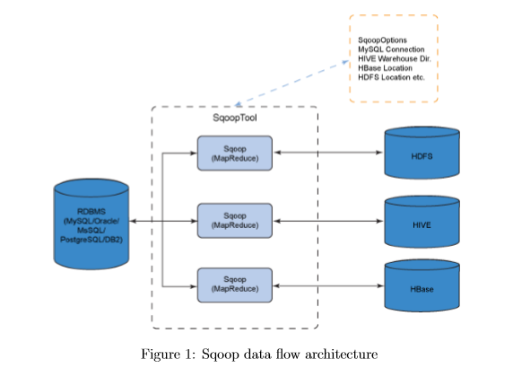

=================
HIVE INSTALLATION
=================

This section refers to the installation settings of Hive on a standalone system
as well as on a system existing as a node in a cluster.

INTRODUCTION
************

    Apache Hive is a data warehouse infrastructure built on top of Hadoop for providing data summarization, query, and analysis. Apache Hive supports analysis of large datasets stored in Hadoop's HDFS and compatible file systems such as Amazon S3 filesystem. It provides an SQL-like language called HiveQL(Hive Query Language) while maintaining full support for map/reduce.

Hive Installation
*****************

Installing HIVE:
================

- Browse to the link: http://apache.claz.org/hive/stable/

- Click the apache-hive-0.13.0-bin.tar.gz

- Save and Extract it

    Commands ::

        user@ubuntu:~$  cd  /usr/lib/
        user@ubuntu:~$  sudo mkdir hive
        user@ubuntu:~$  cd Downloads
        user@ubuntu:~$  sudo mv apache-hive-0.13.0-bin /usr/lib/hive

Setting Hive environment variable:
==================================

Commands ::

    user@ubuntu:~$  cd
    user@ubuntu:~$  sudo gedit  ~/.bashrc

Copy and paste the following lines at end of the file ::

    # Set HIVE_HOME
    export HIVE_HOME="/usr/lib/hive/apache-hive-0.13.0-bin"
    PATH=$PATH:$HIVE_HOME/bin
    export PATH

Setting HADOOP_PATH in HIVE config.sh
=====================================

Commands ::

    user@ubuntu:~$ cd  /usr/lib/hive/apache-hive-0.13.0-bin/bin
    user@ubuntu:~$ sudo gedit hive-config.sh

Go to the line where the following statements are written ::

    # Allow alternate conf dir location.
    HIVE_CONF_DIR="${HIVE_CONF_DIR:-$HIVE_HOME/conf"
    export HIVE_CONF_DIR=$HIVE_CONF_DIR
    export HIVE_AUX_JARS_PATH=$HIVE_AUX_JARS_PATH

Below this write the following ::

    export HADOOP_HOME=/usr/local/hadoop    (write the path where hadoop file is there)

Create Hive directories within HDFS
===================================

Command ::

    user@ubuntu:~$   hadoop fs -mkdir /usr/hive/warehouse

Setting READ/WRITE permission for table
========================================

Command ::

    user@ubuntu:~$  hadoop fs -chmod g+w /usr/hive/warehouse

HIVE launch
============

Command ::

    user@ubuntu:~$  hive

Hive shell will prompt:

OUTPUT
------

Shell will look like ::

    Logging initialized using configuration in jar:file:/usr/lib/hive/apache-hive-0.13.0-bin/lib/hive- common-0.13.0.jar!/hive-log4j.properties
    hive>

Creating a database
===================

Command ::

    hive> create database mydb;

OUTPUT ::

    OK
    Time taken: 0.369 seconds
    hive>

Configuring hive-site.xml:
==========================

Open with text-editor and change the following property ::

    <property>
        <name>hive.metastore.local</name>
        <value>TRUE</value>
        <description>controls whether to connect to remove metastore server or open a new metastore server in Hive Client JVM</description>
    </property>

    <property>
        <name>javax.jdo.option.ConnectionURL</name>
        <value>jdbc:mysql://usr/lib/hive/apache-hive-0.13.0-bin/metastore_db? createDatabaseIfNotExist=true</value>
        <description>JDBC connect string for a JDBC metastore</description>
    </property>

    <property>
        <name>javax.jdo.option.ConnectionDriverName</name>
        <value>com.mysql.jdbc.Driver</value>
        <description>Driver class name for a JDBC metastore</description>
    </property>

    <property>
        <name>hive.metastore.warehouse.dir</name>
        <value>/usr/hive/warehouse</value>
        <description>location of default database for the warehouse</description>
     </property>

Writing a Script
================

Open a new terminal (CTRL+ALT+T) ::

    user@ubuntu:~$ 	sudo gedit sample.sql

    create database sample;
    use sample;
    create table product(product int, productname string, price float)[row format delimited fields terminated by ',';]
    describe product;

load data local inpath '/home/hduser/input_to_product.txt' into table product ::

    select * from product;

SAVE and CLOSE ::

    user@ubuntu:~$ sudo gedit input_to_product.txt
    user@ubuntu:~$ cd /usr/lib/hive/apache-hive-0.13.0-bin/ $ bin/hive -f /home/hduser/sample.sql

===================
SQOOP INSTALLATION
===================

This section refers to the installation settings of Sqoop.

INTRODUCTION
============

- Sqoop is a tool designed to transfer data between Hadoop and relational databases.
- You can use Sqoop to import data from a relational database management system (RDBMS) such as MySQL or Oracle into the Hadoop Distributed File System (HDFS), transform the data in Hadoop MapReduce, and then export the data back into an RDBMS. Sqoop automates most of this process, relying on the database to describe the schema for the data to be imported. Sqoop uses MapReduce to import and export the data, which provides parallel operation as well as fault tolerance. This document describes how to get started using Sqoop to move data between databases and Hadoop and provides reference information for the operation of the Sqoop command-line tool suite.

Stable release and Download
===========================

Sqoop is an open source software product of the Apache Software Foundation.
Sqoop source code is held in the Apache Git repository.

Prerequisites
=============

Before we can use Sqoop, a release of Hadoop must be installed and con?gured. Sqoop is currently supporting 4 major Hadoop releases - 0.20, 0.23, 1.0 and 2.0. We have installed Hadoop 2.2.0 and it is compatible with sqoop 1.4.4.We are using a Linux environment Ubuntu 12.04 to install and run sqoop. The basic familiarity with the purpose and operation of Hadoop is required to use this product.

Installation
============

To install the sqoop 1.4.4 we followed the given sequence of steps :

1.  Download the sqoop-1.4.4.bin_hadoop-1.0.0.tar.gz  file from
    www.apache.org/dyn/closer.cgl/sqoop/1.4.4

2.  Unzip the tar ?le: sudo tar -zxvf sqoop-1.4.4.bin hadoop1.0.0.tar.gz

3.  Move sqoop-1.4.4.bin hadoop1.0.0 to sqoop using command ::

    user@ubuntu:~$  sudo mv sqoop  1.4.4.bin hadoop1.0.0 /usr/local/sqoop

4.  Create a directory sqoop in usr/lib using command ::

    user@ubuntu:~$ sudo mkdir /usr/lib/sqoop

5.  Go to the zipped folder sqoop-1.4.4.bin_hadoop-1.0.0 and run the command ::

    user@ubuntu:~sudo mv ./* /usr/lib/sqoop

6.  Go to root directory using cd command ::

    user@ubuntu:~$  cd

7.  Open bashrc file using ::

    user@ubuntu:~$  sudo gedit ~/.bashrc

8. Add the following lines ::

    export SQOOP_HOME=¡usr/lib/sqoop
    export PATH=$PATH:$SQOOP_HOME/bin

9. To check if the sqoop has been installed  successfully type the command ::

    sqoop version

===================================
IMPORTING DATA FROM HADOOP TO MYSQL
===================================

Steps to install mysql
======================

- Run the command :sudo apt-get install mysql-server and give appropriate username and password.

Using sqoop to perform import to hadoop from sql
================================================

1. Download mysql-connector-java-5.1.28-bin.jar and move to /usr/lib/sqoop/lib using command ::

    user@ubuntu:~$ sudo cp mysql-connnectpr-java-5.1.28-bin.jar /usr/lib/sqoop/lib/

2. Login to mysql using command ::

    user@ubuntu:~$   mysql -u root -p

3. Login to secure shell using command ::

    user@ubuntu:~$  ssh localhost

4. Start hadoop using the command ::

    user@ubuntu:~$  bin/hadoop start-all.sh

5. Run the command ::

    user@ubuntu:~$ sqoop import -connect jdbc:mysql://localhost:3306/sqoop -username root -pasword abc -table employees -m

This command imports the employees table from the sqoop directory of myql to hdfs.

Error points
============

1. Do check if the hadoop is in safe mode using command ::

    user@ubuntu:~$hadoop dfsadmin -safemode get

If you are getting safemode is on, run the command ::

    user@ubuntu:~$hadoop dfsadmin -safemode leave

and again run the command ::

    user@ubuntu:~$hadoop dfsadmin -safemode get

and confirm that you are getting safemode is off.

2. Do make sure that haoop is running before performing the import action.

