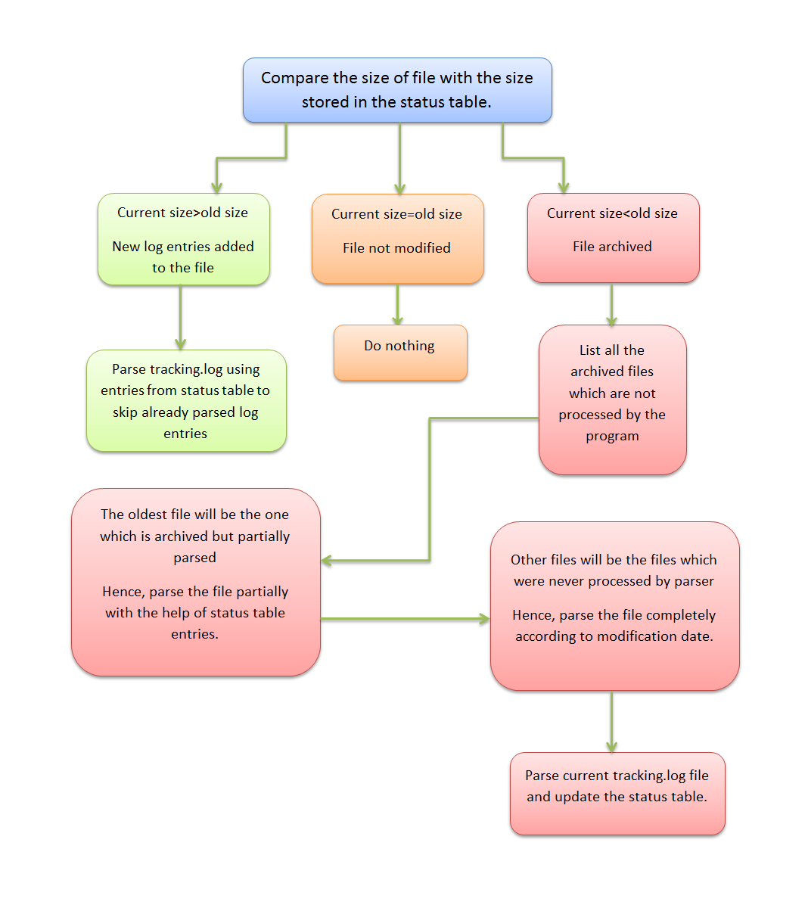
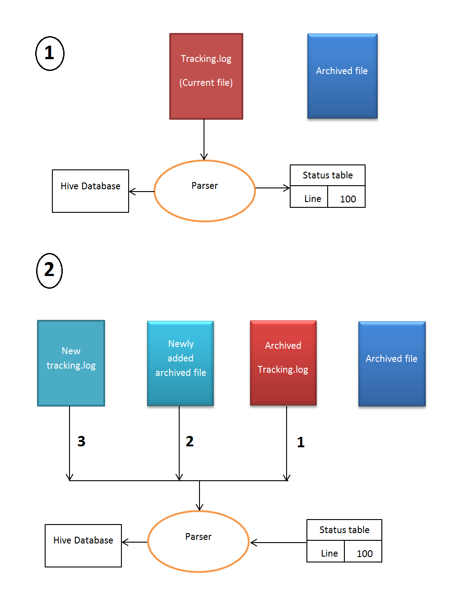

===============
**Log Parsing**
===============

Log files provides information about the event data that is delivered in data packages. Events are emitted by the server or the browser to capture information about interactions with the courseware and the Instructor Dashboard in the LMS, and are stored in JSON documents. In the data package, event data is delivered in a log file.The JSON documents that include event data are delivered in a machine-readable format that is difficult to read . A sample is the following :- ::

   {"agent": "Mozilla/5.0 (X11; Linux x86_64) AppleWebKit/537.36 (KHTML, like Gecko)
   Chrome/30.0.1599.101 Safari/537.36", "context": {"course_id": "edx/AN101/2014_T1",
   "module": {"display_name": "Multiple Choice Questions"}, "org_id": "edx", "user_id":
   9999999}, "event": {"answers": {"i4x-edx-AN101-problem-a0effb954cca4759994f1ac9e9434bf4_2_1":
   "yellow", "i4x-edx-AN101-problem-a0effb954cca4759994f1ac9e9434bf4_4_1": ["choice_0", "choice_2"]},
   "attempts": 1, "correct_map": {"i4x-edx-AN101-problem-a0effb954cca4759994f1ac9e9434bf4_2_1":
   {"correctness": "incorrect", "hint": "", "hintmode": null, "msg": "", "npoints": null,
   "queuestate": null}, "i4x-edx-AN101-problem-a0effb954cca4759994f1ac9e9434bf4_4_1":
   {"correctness": "correct", "hint": "", "hintmode": null, "msg": "", "npoints": null,
   "queuestate": null}}, "grade": 2, "max_grade": 3, "problem_id": "i4x://edx/AN101/problem/
   a0effb954cca4759994f1ac9e9434bf4", "state": {"correct_map": {}, "done": null, "input_state":
   {"i4x-edx-AN101-problem-a0effb954cca4759994f1ac9e9434bf4_2_1": {}, "i4x-edx-AN101-problem-
   a0effb954cca4759994f1ac9e9434bf4_4_1": {}}, "seed": 1, "student_answers": {}}, "submission":
   {"i4x-edx-AN101-problem-a0effb954cca4759994f1ac9e9434bf4_2_1": {"answer": "yellow", "correct":
   false, "input_type": "optioninput", "question": "What color is the open ocean on a sunny day?",
   "response_type": "optionresponse", "variant": ""}, "i4x-edx-AN101-problem-
   a0effb954cca4759994f1ac9e9434bf4_4_1": {"answer": ["a piano", "a guitar"], "correct": true,
   "input_type": "checkboxgroup", "question": "Which of the following are musical instruments?",
   "response_type": "choiceresponse", "variant": ""}}, "success": "incorrect"}, "event_source":
   "server", "event_type": "problem_check", "host": "precise64", "ip": "NN.N.N.N", "page": "x_module",
   "time": 2014-03-03T16:19:05.584523+00:00", "username": "AAAAAAAAAA"}

We can use pretty print( by jq '.' command) to see this information in a readable format which is shown as below :- ::

   {
      "agent": "Mozilla/5.0 (X11; Linux x86_64) AppleWebKit/537.36 (KHTML, like Gecko) Chrome/30.0.1599.101 Safari/537.36",
      "context": {
          "course_id": "edx/AN101/2014_T1",
          "module": {
              "display_name": "Multiple Choice Questions"
          },
          "org_id": "edx",
          "user_id": 9999999
      },
      "event": {
          "answers": {
              "i4x-edx-AN101-problem-a0effb954cca4759994f1ac9e9434bf4_2_1": "yellow",
              "i4x-edx-AN101-problem-a0effb954cca4759994f1ac9e9434bf4_4_1": [
                  "choice_0",
                  "choice_2"
              ]
          },
          "attempts": 1,
          "correct_map": {
              "i4x-edx-AN101-problem-a0effb954cca4759994f1ac9e9434bf4_2_1": {
                  "correctness": "incorrect",
                  "hint": "",
                  "hintmode": null,
                  "msg": "",
                  "npoints": null,
                  "queuestate": null
              },
              "i4x-edx-AN101-problem-a0effb954cca4759994f1ac9e9434bf4_4_1": {
                  "correctness": "correct",
                  "hint": "",
                  "hintmode": null,
                  "msg": "",
                  "npoints": null,
                  "queuestate": null
              }
          },
          "grade": 2,
          "max_grade": 3,
          "problem_id": "i4x://edx/AN101/problem/a0effb954cca4759994f1ac9e9434bf4",
          "state": {
              "correct_map": {},
              "done": null,
              "input_state": {
                  "i4x-edx-AN101-problem-a0effb954cca4759994f1ac9e9434bf4_2_1": {},
                  "i4x-edx-AN101-problem-a0effb954cca4759994f1ac9e9434bf4_4_1": {}
              },
              "seed": 1,
              "student_answers": {}
          },
          "submission": {
              "i4x-edx-AN101-problem-a0effb954cca4759994f1ac9e9434bf4_2_1": {
                  "answer": "yellow",
                  "correct": false,
                  "input_type": "optioninput",
                  "question": "What color is the open ocean on a sunny day?",
                  "response_type": "optionresponse",
                  "variant": ""
              },
              "i4x-edx-AN101-problem-a0effb954cca4759994f1ac9e9434bf4_4_1": {
                  "answer": [
                      "a piano",
                      "a guitar"
                  ],
                  "correct": true,
                  "input_type": "checkboxgroup",
                  "question": "Which of the following are musical instruments?",
                  "response_type": "choiceresponse",
                  "variant": ""
              }
          },
          "success": "incorrect"
      },
      "event_source": "server",
      "event_type": "problem_check",
      "host": "precise64",
      "ip": "NN.N.N.N",
      "page": "x_module",
      "time": "2014-03-03T16:19:05.584523+00:00",
      "username": "AAAAAAAAAA"
   }
   

The JSON object 'event_source' is the most important feture we are dealing with. All the entries in the tracking.log file get parsed into the log table of our database. There is an entry corresponding to every event generated in the log files. Different types of events are generated. Common fields of those events are as follows:-
 
:Agent:
| Browser agent string of the user who triggered the event
:Context:
| For all events, this field includes member fields that identify:
   * The course_id of the course that generated the event. 
   * The org_id of the organization that lists the course. 
   * The user_id of the individual who is performing the action. 
:Event:
| This field includes member fields that identify specifics of each triggered event.
:event_source:
| Specifies whether the triggered event originated in the browser or on the server.
:event_type:
| The type of event triggered.
:Host:
| The site visited by the user, for example, courses.edx.org.
:ip:
| IP address of the user who triggered the event.
:page:
| The '$URL' of the page the user was visiting when the event was emitted.
:session:
| This 32-character value is a key that identifies the user's session.
:time:
| Gives the UTC time at which the event was emitted in 'YYYY-MM- DDThh:mm:ss.xxxxxx' format.
:username:
| The username of the user who caused the event to be emitted. This string is empty for anonymous events, such as when the user is not logged in.

| Each and every event has its own attributes. Various types of events generated which we have used are as follows:-

* Problem_check generated at two sources , browser and server.
* Problem_show
* load_video
* play_video
* speed_change_video
* seek_video
* pause_video  

Procedure
----------
| Entries of log files are parsed and then stored in database.
| For each log entry genral data like ip address, event_type, event_source is stored in table log.
| Data related to specific event_type is stored in corresponding tables like play_video, puase_video.

Following jar files are used in the the java program to parse the log files:-

* java-json.jar
* apache-logging-log4j.jar
* commons-httpclient-3.0.1.jar
* commons-logging-1.1.3.jar
* hadoop-core-1.2.0.jar
* hive-cli-0.13.0.jar
* hive-common-0.13.0.jar
* hive-exec-0.13.0.jar
* hive-jdbc-0.13.0.jar
* hive-metastore-0.13.0.jar
* hive-service-0.13.0.jar
* hive.txt
* libfb303-0.9.0.jar
* libthrift-0.9.0.jar
* log4j-1.2.16.jar
* slf4j-api-1.7.7.jar
* slf4j-jdk14-1.7.7.jar

Let the old_size be the size of the file which has been already parsed and whose value has been stored in the status table. Let new_size be the size of the log file at present.
There are three cases for the log files which are as folllows:-

| 1. old_size < new_size

It means that new entries has been added to the log files . The value of number of lines that have been parsed is stored in status table .That value is retrieved and those many lines skipped.Rest of the lines are parsed.Log entries are in the form of json .Folllowing is a snippet for this case:- ::

   public class LineParser {
   public int parseline(String line)
	{
		int success=0;
		Database db = new Database();
		JSONObject rootObject;
		try {
			rootObject = new JSONObject(line);
			Log log = new Log();
	        JSONObject context = rootObject.getJSONObject("context");
	        log.setCourse_id(context.get("course_id").toString();    											
	        log.setOrg_id(context.get("org_id").toString												
	        try
	        {
	        	log.setUser_id((Integer)context.get("user_id"));											
	        }
	        catch(Exception e)
	        {
	        	log.setUser_id(0);
	        }
	        try
	        {
	            JSONObject module = context.getJSONObject("module");
	            log.setModule(module.get("display_name").toString());											//3rd field
	        }
	        catch (Exception e)
	        {
	        	log.setModule("");	
	        }
	        log.setEvent_source(rootObject.get("event_source").toString());									//7th field
	        log.setEvent_type(rootObject.get("event_type").toString());											//6th and 8th field
	        log.setHost(rootObject.get("host").toString());													//9th field
	        log.setIp(rootObject.get("ip").toString());														//10th field
	        log.setPage(rootObject.get("page").toString());													//11th field
	        String time = rootObject.get("time").toString();
	        String time2=time.substring(0, 10);
	        time2=time2.concat(" ");
	        //system.out.println("********"+time2+"***********");
	        time2=time2.concat(time.substring(11,19));
	        log.setTime(time2);																				//12th field
	        log.setUsername(rootObject.get("username").toString());											//13th field
	        log.setEvent(rootObject.get("event").toString());
	        try
	        {
	        	log.setSession(rootObject.get("session").toString());
	        }
	        catch(Exception e)
	        {
	        	log.setSession("");
	        }
	        
	    	success = db.insertlogdata(log);
		}
		catch (JSONException e1)
		{
			e1.printStackTrace();
		}   
		return success;
	}
   }

| 2. old_size=new_size

| The log file has not changed and no new entries added.

| 3. old_size >new_size

| This means that the log file has been archived.So all those file whose modification time is greater than the time stored in the status table, which is the modification time of the log file just processed, are retrieved and extracted.
| It is possible that the current file which program was parsing is modified i.e., new log entries are added to the file and is now archived. So, we need to find the archived file corresponding to the file which was being parsed and parse and process if any new entries were added to the file.
| The file whose modification date is oldest among those files is the file which was archived while program was parsing it. Those new entries which were added are parsed with the help of values such as linesparsed and size of file stored in the status table.Rest of the files are processed from beginning to the end.

Following is a code snippet of the following case::

   public class  {
   	public void handlefile()
   	{
   		System.out.println("Entered into filehandler");
   		
   		File mydirectory = new File("/home/sachin/workspace/json/src/json/log");
   		
   		System.out.println(mydirectory.isDirectory());
   		
   		File names[] = mydirectory.listFiles();
   		Database db = new Database();
   		
   		//getting filelastmodified date
   		long lastmdate=db.getfilelastmodified();
   		
   		//creating arraylist to store new tar.gz files
   		ArrayList<File> left = new ArrayList<File>();
   		
   		//adding new files into the arraylist
   		for(int i=0;i<names.length;i++)
   		{
   			if(names[i].lastModified()>lastmdate&&names[i].toString().matches(".*gz$"))
   			{
   				left.add(names[i]);
   				System.out.println("got match: "+names[i].lastModified()+" "+names[i]);
   			}
   		}
   	
   		long table[][] = new long[left.size()][2];
   		
   		//intializing two dimensional array
   		for(int i=0;i<left.size();i++)
   		{
   			table[i][0] = i;
   			table[i][1] = left.get(i).lastModified();
   			System.out.println(table[i][0]+" "+table[i][1]);
   		}
   		
   		//sorting according to the date
   		for (int c = 0; c <  left.size(); c++) 
   		{
   		   for (int d = 0; d < left.size() - c - 1; d++) 
   		   {
   			   if(table[d][1] > table[d+1][1])
   			   {
   				   long swap = table[d][0];
   				   table[d][0]=table[d+1][0];
   				   table[d+1][0]=swap;
   				   swap = table[d][1];
   				   table[d][1]=table[d+1][1];
   				   table[d+1][1]=swap;
   			   }
   		   }
   		}
   		InputStream is=null;
   		boolean first=true;
   		String line;
   		LineParser lp = new LineParser();
   		for(int i=0;i<left.size();i++)
   		{
   			try
   			{
   				if(first)
   				{
   					
   					System.out.println("started reading file "+left.get((int) table[i][0]));
   					int linenum = db.getlinenum();
   					System.out.println("line count in file"+linenum);
   					is = new GZIPInputStream(new FileInputStream(left.get((int) table[i][0])));
   BufferedReader buffered = new BufferedReader(new InputStreamReader(is));
   					int j=0;
   					/
   					while(j<linenum)
   					{
   						if((line=buffered.readLine())!=null)
   						{
   							j++;
   							System.out.println("The value of the j is "+j);
   						}
   					}
   					while((line=buffered.readLine())!=null)
   					{
   						System.out.println(line);
   						if(line.startsWith("{"))
   						{
   							lp.parseline(line);
   						}
   					}
   					buffered.close();
   					first=false;
   					db.setfilelastmodified(left.get((int) table[i][0]).lastModified());
   				}
   				else
   				{
   
   					System.out.println("started reading file "+left.get((int) table[i][0]));
   					is = new GZIPInputStream(new FileInputStream(left.get((int) table[i][0])));
   					Reader decoder = new InputStreamReader(is, "UTF-8");
   					BufferedReader buffered = new BufferedReader(decoder);
   					while((line=buffered.readLine())!=null)
   					{
   						if(line.startsWith("{"))
   						{
   							lp.parseline(line);
   						}
   						System.out.println(line);
   					}
   					buffered.close();
   					db.setfilelastmodified(left.get((int) table[i][0]).lastModified());
   				}
   			}
   			catch(Exception e)
   			{
   				System.out.println("error while reading tar.gz files"+left.get((int) table[i][0]));
   			}
   		}
   		db.setsize(0);
   		db.insertlinenum(0);
   	}
   }

And the flowchart for the same is:
 

  

After the classification has been done, queries were written on the tables to extract the features required for implementing machine learning.

Importing data from mysql to hive:
----------------------------------

The database schema above defined was first made in mysql. Then it was imported into hive by sqoop. But later on, we came up with a method by which we could directly connect with hive from the java program.

